### selected

| | | |
|:--|:--|--:|
| [**PalkaDPI**](https://github.com/zondaxxx/PalkaDPI) | local DPI bypass for iOS, on-device strategy autotune | `swift` |
| [**Flomsi**](https://github.com/zondaxxx/Flomsi) | keyboard-first mail client for desktop and mobile — Rust core, Flutter UI | `rust` |
| [**podlink**](https://github.com/zondaxxx/podlink) | AirPods companion for Android without root — battery, popup, ear detection | `kotlin` |
| [**IU5-Library**](https://github.com/zondaxxx/IU5-Library) | unofficial library site for IU5 students | `typescript` |
| [**SteamMobileAuthenticator**](https://github.com/zondaxxx/SteamMobileAuthenticator) | Steam mobile auth, reimplemented | `dart` |
| [**yandex_station**](https://github.com/zondaxxx/yandex_station) | Homebridge plugin for Yandex Station | `python` |
| [**zondaxxx.github.io**](https://github.com/zondaxxx/zondaxxx.github.io) | PS1-style landing: low-poly Ghostface, wobbly vertices, dithering, CRT overlay | `webgl` |

 

### stack

`swift` `kotlin` `rust` `dart` `typescript` `python` `c` `x86 asm` — `flutter` `xray` `docker` `nginx` `postgres`

 

### now

→ Flomsi — one mail client for every account, every platform
 
→ PalkaDPI: iOS `0.4.7`, Android `0.5.0` out
 
→ systems programming, semester 3

 

[zondaxxx.github.io](https://zondaxxx.github.io/)

 

