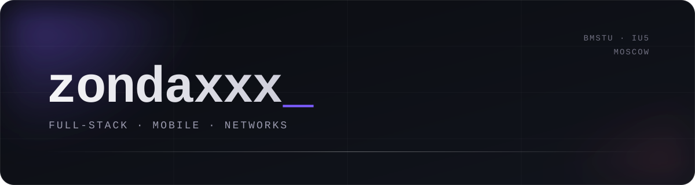

### selected

| | | |
|:--|:--|--:|
| [**MuseDPI**](https://github.com/zondaxxx/MuseDPI) | local DPI bypass for iOS and Android, on-device strategy autotune | `swift` · `kotlin` |
| [**Melsi**](https://github.com/zondaxxx/Melsi) | cross-platform VPN client — smart routing, Double VPN, game mode | `dart` · `go` |
| [**Flomsi**](https://github.com/zondaxxx/Flomsi) | keyboard-first mail client for desktop and mobile — Rust core, Flutter UI | `rust` |
| [**podlink**](https://github.com/zondaxxx/podlink) | AirPods companion for Android without root — battery, popup, ear detection | `kotlin` |
| [**IU5-Library**](https://github.com/zondaxxx/IU5-Library) | unofficial library site for IU5 students | `typescript` |
| [**SteamMobileAuthenticator**](https://github.com/zondaxxx/SteamMobileAuthenticator) | Steam mobile auth, reimplemented | `dart` |
| [**yandex_station**](https://github.com/zondaxxx/yandex_station) | Homebridge plugin for Yandex Station | `python` |
| [**zondaxxx.github.io**](https://github.com/zondaxxx/zondaxxx.github.io) | PS1-style landing: low-poly Ghostface, wobbly vertices, dithering, CRT overlay | `webgl` |

 

### stack

`swift` `kotlin` `rust` `dart` `typescript` `go` `python` `c` `x86 asm` — `flutter` `xray` `sing-box` `docker` `nginx` `postgres`

 

### now

→ [Melsi `1.1.2`](https://github.com/zondaxxx/Melsi/releases/tag/v1.1.2) — sing-box `1.14`, smart routing, Double VPN & game mode · mobile startup and iOS command socket fixes
 
→ Flomsi `0.2.5` — your own folders & Gmail labels, Intel Macs · one mail client for every account · [flomsi.nz](https://flomsi.nz)
 
→ [MuseDPI](https://github.com/zondaxxx/MuseDPI) (formerly PalkaDPI) — iOS [`0.4.8`](https://github.com/zondaxxx/MuseDPI/releases/tag/v0.4.8), Android [`0.5.1`](https://github.com/zondaxxx/MuseDPI/releases/tag/android-v0.5.1) · refreshed branding, diagnostics & screenshots
 
→ systems programming, semester 3 — x86 asm labs

 

[zondaxxx.github.io](https://zondaxxx.github.io/)

 

